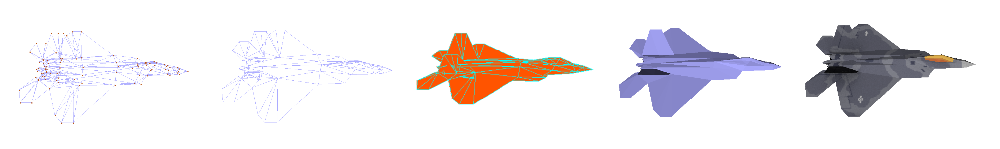

<!-- Display ./example.png -->
<p align="center">
	
<p align="center">

# Expresso

Old school 3D engine from scratch in C.

## Dev Env

```
sudo apt install build-essential
sudo apt install libsdl2-dev
make release=1
./bin/linux/release/expresso
```

---

# Ressources

Started the implementation by following [Pikuma's course on 3D Computer Graphics](https://pikuma.com/courses).
- [Perspective-Correct Interpolation](https://s3.amazonaws.com/thinkific/file_uploads/167815/attachments/c06/b72/f58/KokLimLow-PerspectiveCorrectInterpolation.pdf)
- [upng](https://github.com/elanthis/upng)
- [SDL2](https://www.libsdl.org/)

**Next steps**:
- Gouraud shading
- [Phong Model](https://graphics.stanford.edu/courses/cs348b-07/lectures/reflection_ii/reflection_ii.pdf)
- Move from SDL to Raylib
- GPU acceleration

---

# 3D Pipeline:
- **1** Model space
- **2** World space
- **3** Camera space
- **3.5** Backface culling
- **4** Frustum culling/clipping (GPU do it after the projection usually)
- **5** Projection
- **5.5** Perspective divide
- **6** Image space (NDC)
- **7** Screen Space

---

# Result

<p align="center">
	
<p align="center">


---

# Personnal Notes

```
    y+
    |    
    |   z+      . (1, 0, 1)
    |  /   
    | /
____|/________ x+
    /
   /|
  / |
```

**Z axis growth + in the screen**:
- Left handed coordinate system
- Clockwise winding order for triangle
- A normal would be: `N = (B - A) x (C - A)`

## Moving an element by moving the vertices

**Rotation**
REM: SOH CAH TOA ;)
```
Rotation is the following
- We have:
    x = r cos(a) and y = r sin (a)
- We want
    x' = r cos(a+b) and y' = r sin(a+b)

- Then with the angle addition formula for cosine
x' = r cos(a + b)
x' = r (cos(a) cos(b) - sin(a) sin(b))
x' = r cos(a) cos(b) - r sin(a) sin(b)
x' = x cos(b) - y sin(b)

So then the matrix will be:
[cos(a) -sin(a)] [x]
[sin(a)  cos(a)] [y]

And extending to the next dimention:

[cos(a) -sin(a)  0 ] [x]
[sin(a)  cos(a)  0 ] [y]
[ 0       0      1 ] [z]
```

**3D Mesh**
Each triangle has `3 vertex` (corners)

Let's check the code for a cube
```C
#include "vector.h"

// those are points
vec3_t cube_vertices[8] = {
    { .x = -1, .y = -1, .z = -1},   // 1
    { .x = -1, .y =  1, .z = -1},   // 2
    { .x =  1, .y =  1, .z = -1},   // 3
    { .x =  1, .y = -1, .z = -1},   // 4
    { .x =  1, .y =  1, .z =  1},   // 5
    { .x =  1, .y = -1, .z =  1},   // 6
    { .x = -1, .y =  1, .z =  1},   // 7
    { .x = -1, .y = -1, .z =  1},   // 8
};

// for a face (triangle)
typedef struct {
    int a, b, c;
}  face_t;

// the collection of triangle for the cube
//   warning: the order matter because 
//   we want a front and a back face
//
//   here: we do a clock wise orientation
face_t cube_faces[12] = {
    // front
    { .a = 1, .b = 2, .c = 3},
    { .a = 1, .b = 3, .c = 4},
    // right
    { .a = 4, .b = 3, .c = 5},
    { .a = 4, .b = 5, .c = 6},
    // back
    { .a = 6, .b = 5, .c = 7},
    { .a = 6, .b = 7, .c = 8},
    // left
    { .a = 8, .b = 7, .c = 2},
    { .a = 8, .b = 5, .c = 1},
    // top
    { .a = 2, .b = 7, .c = 5},
    { .a = 2, .b = 5, .c = 3},
    // bottom
    { .a = 6, .b = 8, .c = 1},
    { .a = 6, .b = 1, .c = 4},
};
```

**Lines**
Line drawing algorithms (Rasterize):
- [__Old solition__] **Naive algorithm**
- [__Old solition__] **Digital Differential Analyzer** (DDA graphics algorithm) — Similar to the naive line-drawing algorithm, with minor variations.
    - Warning: a bit slower because of the `/` operation
- [__Current solution__] **Bresenham's line algorithm** - Optimized to use only additions (i.e. no division Multiplications); it also avoids floating-point computations.
- **The Gupta-Sproull algorithm** - Based on Bresenham's line algorithm but adds antialiasing.

**Triagles**
Filled triangle algorithms used: simple scanline algorithm, with a flat-bottom and flat-top triangle.


### Triangle with color
__Problem__: The order of the face being render is important for the depth.

__Old solition__: Painters Algorithm, assumption: Z-value is the average of the 3 points.

__Current solution__: Z-buffering (or depth buffering)

---

# Using matrix to represent 3D transformations

Homogeneous coordinates - 4x4 Matrix

```
[ m  m  m  m ] [ x ]
[ m  m  m  m ] [ y ]
[ m  m  m  m ] [ z ]
[ m  m  m  m ] [ w ]
```
- m: extra component to enable matrix transformation, set to 1.
- 4x4: because some transformation required extra information for them to work.

#### Scaling matrix
```
[ sx  0  0  0 ] [ x ]
[  0 sy  0  0 ] [ y ]
[  0  0 sz  0 ] [ z ]
[  0  0  0  1 ] [ w ]
```

#### Translation matrix
```
[ 1  0  0 tx ] [ x ]
[ 0  1  0 ty ] [ y ]
[ 0  0  1 tz ] [ z ]
[ 0  0  0  1 ] [ w ]
```

#### Rotation matrix
```
[ cos(a) -sin(a)  0  0 ] [ x ]
[ sin(a)  cos(a)  0  0 ] [ y ]
[  0       0      1  0 ] [ z ]
[  0       0      0  1 ] [ w ]
```

#### Projection matrix

- Aspect ration: `a = width / height`
- Field of view: `f = 1 / tan(fov / 2)`
```
[x]    [afx]
[y] -> [fy ] 
[z]    [ z ]
```
- We have to normalize the z value
```
--------- z_far ----------
\                        /
 \ 	       ___      /
  \            |_|     /
   \                  /
    \                /
     \              /
      \            /
       \--z_near--/   <- Screen
        \        /
         \      /
	  \    /
	   obs
```
```
lambda = (z_far / (z_far - z_near)) - (z_far * z_near / (z_far - z_near))
|--------- scaling ---------------|   |------- offset / translation ----|
```


```
[x]    [           afx            ]
[y] -> [           fy             ] 
[z]    [ lambda*z - lambda*z_near ]
```
#### So the final projection matrix
```
[ af   0    0          0        ]
[  0   f    0          0        ]
[  0   0 lambda  -lambda*z_near ]
[  0   0    1          0        ]
```

---

# Shading
### Flat shading
One of the simplest shading techniques, it calculates the color of each polygon, based on the color of the light source and the color of the polygon itself.

### Other shading
- Gouraud shading
- Phong reflexion model

# Texture
A texture is a bitmap image applied to a 3D model. It can be used to add details to the model that would be difficult to model with geometry.

We can load a png, and "paint" the triangle with the pixel value.
- Each vertex has a coordinate (UV Coordinate) in the texture space, and we interpolate the pixel value between the 3 points.
- Texture: UV coord are between 0 and 1

Representing Texture in memory:
"Color information in sequence"
- Will be a buffer in memory, `uint32_t* texture`

Finding the mapping: Barycentric coordinates
- alpha, beta, gamma: the 3 weights of the 3 points of the triangle
- `P = alpha * A + beta * B + gamma * C`
- `alpha + beta + gamma = 1`
- To find alpha, beta, gamma:
    - using 3 points, we extand to a parallelogram and find the area
    - `alpah = area_triangle(PBC) / area_triangle(ABC)`
    - `alpah = area_parallelogram(PBCD) / area_parallelogram(ABCD)`
    - `alpah = ||PCxPV|| / ||ACxAB||` (lenght of the cross product)
- Same for beta and gamma

---

# Camera
Models:
- Look-at camera model (Always look at a target)
- FPS camera model

## Look-at camera model
We need a `look_at` function that will create a matrix to rotate the camera to look at a point.
 → **Will convert the vertices to the camera space**

We need:
- A `eye` position
- A `target` position

The transformation consists of 2 steps:
1. Translate the eye to the origin matrix
2. Rotate the eye to look at the target (with reverse orientation)

`M_view = M_look_at * M_translate_eye`
### Translation
Move the eye to the origin
```
[ 1  0  0 -eye_x ]
[ 0  1  0 -eye_y ]
[ 0  0  1 -eye_z ]
[ 0  0  0    1   ]
```
### Rotation
For roation, we must compute forward(z), right(x), and up(y) vectors
```
[ x_x y_x z_x 0 ] ^-1
[ x_y y_y z_y 0 ]
[ x_z y_z z_z 0 ]     = M_look_at
[  0   0   0  1 ]
```
But we need the inverse. Here we can transpose the matrix because it's an orthogonal matrix.

### Final matrix
Developing, we can find the final matrix:
```
[ x_x x_y x_z -dot(x, eye) ]
[ y_x y_y y_z -dot(y, eye) ]
[ z_x z_y z_z -dot(z, eye) ]
[  0   0   0        1      ]
```

## FPS camera model
We need:
- position
- direction
- forward velocity
- yaw and pitch (rotation)

---

# Clipping
We need to clip the triangle that is outside the screen.
## Clipping against the screen
- Modern way to do it

## Frustum
We need to clip against six planes:
- Top, Bottom, Left, Right, Near, Far
The resulting polygon that is produced is a convex polygon. We can clip it against the other planes. **Otherwise, we need to accumulate the clipped polygon**

#### Planes

To find the plane (right as the example):

** Near/Far plane **
```
P = {0, 0, z_near}
P = {0, 0, z_far}
```

** Side plane **

We have the point P (the camera at {0, 0, 0}) and the normal N from the fov/2 angle.
```
# Right plane:
P = {0, 0, 0}
n.x = -cos(fov/2)
n.y = 0
n.z = sin(fov/2)
```
Same for the other planes.

**FYI**

Two side of a plane (P), on, inside or outside:
- A point (Q) can be __inside__ the plane. `(Q - P) . N > 0`
- A point (Q) can be __outside__ the plane. `(Q - P) . N < 0`
- A point (Q) can be __on__ the plane. `(Q - P) . N = 0`

### Intersecting a plane
Goal: determine if a line intersects a plane.
__From: Kenneth I. Joy | On-Line Computer Graphics Notes | Clipping__
```
 Q_1       N
  \        ^
   \       |
----I------P-----   <- Place
     \
      Q_2
       Triangle

I = Q_1 + t(Q_2 - Q_1)
- t is the factor to find the intersection point [0, 1]
```
To find the intersection point, we can do:
```
      I = Q_1 + t(Q_2 - Q_1)
  (I-P) = (Q_1-P) + t((Q_2-P) - (Q_1-P))
n.(I-P) = n.(Q_1-P) + t(n.(Q_2-P) - n.(Q_1-P))
-------   ---------     ---------   ---------
   0       Dot_Q_1       Dot_Q_2     Dot_Q_1

   0    =  Dot_Q_1 +  t( Dot_Q_2 - Dot_Q_1 )
   t    = -Dot_Q_1 / (Dot_Q_2 - Dot_Q_1)
   t    =  Dot_Q_1 / (Dot_Q_1 - Dot_Q_2)
```
Once we have the intersection point, we can clip the triangle,
**But we end up with a polygon :(** We need to triangulate it!

But before, algo to clip a polygon against a plane:
```
	    __Q_3__
        __--       --__
    ^  Q_2            Q_4
    |   \            /
----P---I_1---------I_2-
          \        /
	   Q_1---Q_5

| Inside | Outside |
+--------+---------+
|   I_1  |   Q_1   |
|        |   I_2   |
|   Q_2  |         |
|   Q_3  |         |
|   Q_4  |         |
|   I_2  |         |
|        |   I_2   |
|        |   Q_5   |  
```
We end up with two list, one for points for inside and one for outside.
- In this case, the resulting polygone is the inside one: `{I_1, Q_2, Q_3, Q_4, I_2}`

### Converting Polygons into triangles
Technique:
- Vertices to non-adjectent vertices
- Point in the middle of the polygon
- All from the same point:
```
    Q_0____Q_3
    / \    /
   /   \  /
 Q_l---Q_2
```
So:
```
for (int i=0; i < (num_vertices-2); i++)
    add_triangle(Q_0, Q_i+1, Q_i+2)
```

