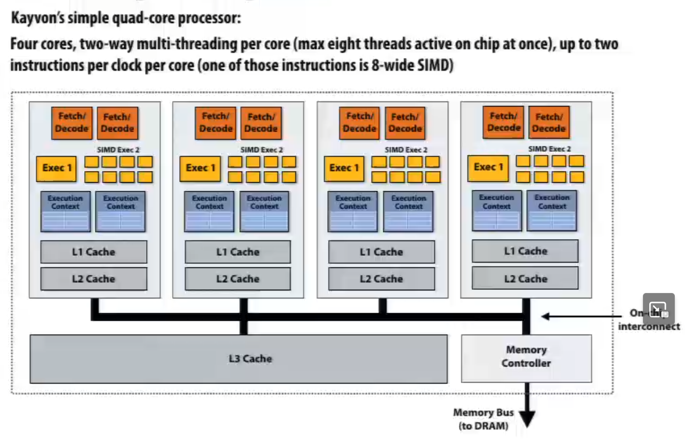
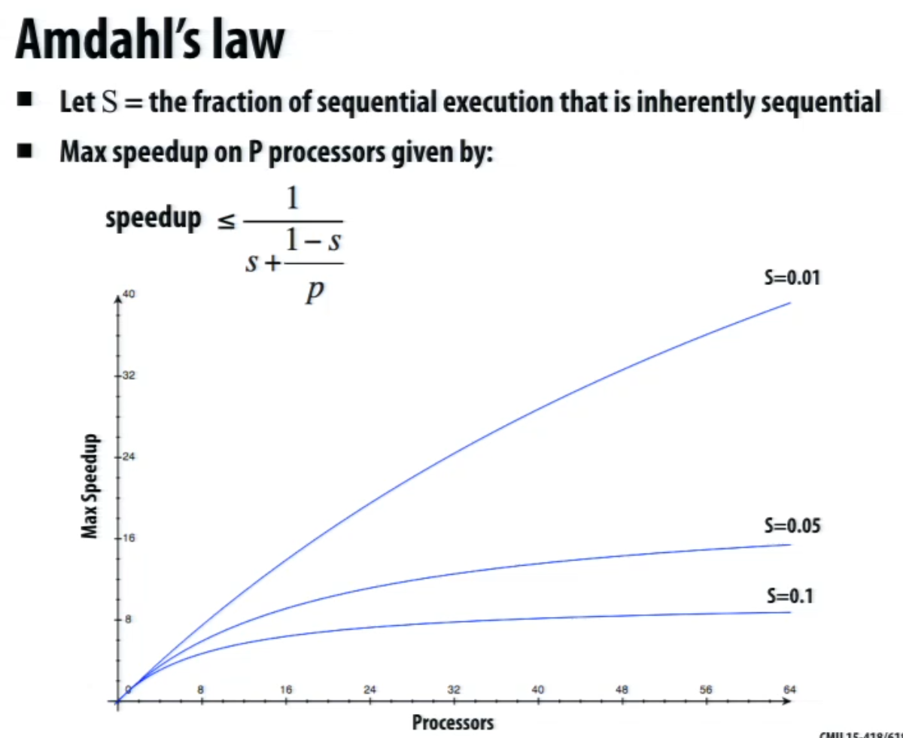
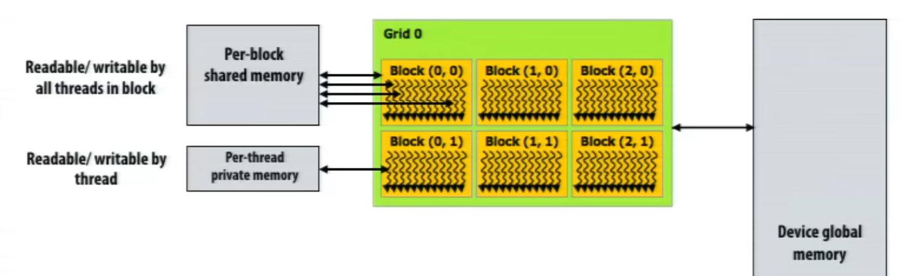
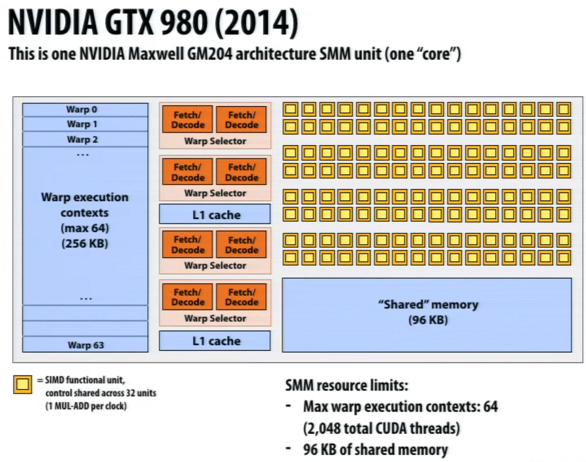

# Parallel Computer Architecture and Programming 
__Carnegie Mellon University__ [Course](http://15418.courses.cs.cmu.edu/spring2016/lectures)

## Table of content

- [Lecture 1](#lecture-1): Why Parallelism
- [Lecture 2](#lecture-2): Forms of parallelism + Latency and Bandwidth
- [Lecture 3](#lecture-3): Ways of thinking about parallel programs, and their corresponding hardware implementations
- [Lecture 4](#lecture-4): Parallel Programming Basics
- [Lecture 5](#lecture-5): GPU Architecture & CUDA Programming

---

# Lecture 1: Why Parallelism
**Goal**: build efficent systems.

Important measure:
- Speedup: `exec_time(i processor) / exec_time(P processor)`
    - Affected by multiple factor:
        - The shared ressources
        - The communcation
        - How the work is distributed: work imbalance
        - Cost of the time to distribute the work / preprocessing / ...
        - A lot of communication can be bad

Designing and writing parallel programs:
- Parallel thinking (Decomposing work into pieces that can safely be performed in parallel, assigning work to processor, managing communication/sync between the processors so that it doesn't limit speedup)
- Abstractions/mechanisms for performing the above tasks

Implementing parallel programs, the underliging architecture / machine is really important

** /!\ WARNING /!\ **: `Fast != Efficient`
- The metric depends on the problem. 2x speedup with a 10x cost, is it good ? depends on the problems

---

# Lecture 2: A Modern Multi-Core Processor

For concept about how modern computers work:
- Two concern parallel execution
- Two concern challenges of accessing memory

### Parallel Execution

Example program
```C
void sinx(int N, int terms, float* x, float* result) {
    for (int i = 0; i < N; i++) {
        float value = x[i];
        float numer = x[i] * x[i] * x[i];
        int denom = 6;  // 3!
        int sign = -1;
        for (int j = 0; j < terms; j++) {
            value += sign * numer / denom;
            numer *= (2*j+2) * (2*j+3);
            sign *= -1;
        }
        result[i] = sum;
    }
}
```
Compiling it, we obtain the assembly/bin, check [here](https://godbolt.org/):
```assembly
sinx:
        push    rbp
        mov     rbp, rsp
        mov     DWORD PTR [rbp-36], edi
        mov     DWORD PTR [rbp-40], esi
        mov     QWORD PTR [rbp-48], rdx
        mov     QWORD PTR [rbp-56], rcx
        mov     DWORD PTR [rbp-4], 0
        jmp     .L2
.L5:
    ...
.L4:
    ...
.L3:
    ...
.L2:
        mov     eax, DWORD PTR [rbp-4]
        cmp     eax, DWORD PTR [rbp-36]
        jl      .L5
        nop
        nop
        pop     rbp
        ret
```

#### Sequential Execution & Computer Architecture

Here we can thing of a (simple) processor as executing for each clock cycle:
- Fetch/Decode: Fetch the instruction
- ALU (Execute): Decode it and execute the instruction
- Execution Context: State that is updated by the instruction (registers)

And a superscalar processor (multiple execution units) will have 
- **N_time** Fetch/Decode: Fetch the instruction
- **N_time** ALU (Execute): Decode it and execute the instruction
- **only one** Execution Context: State that is updated by the instruction (registers)

_+ other fancy stuffs, done by the hardware to speed up the execution_:
- Out-of-order execution
- Branch prediction
- Memory pre-fetcher

Now, let ripoff the fancy stuff, but split into two cores, so to independant time:
- Fetch/Decode
- ALU
- Execution Context
And we obtain a speed up of 1.5x (2 x 0.75 since we remove the fancy stuff)

Updating our code, let's span some PThreads:
```C
typedef struct {
    int N;
    int terms;
    float* x;
    float* result;
} sinx_args;

void parallel_sinx(int N, int terms, float* x, float* result) {
    pthread_t tid;
    sinx_args args;

    args.N = N/2;
    args.terms = terms;
    args.x = x;
    args.result = result;

    pthread_create(&tid, NULL, my_thread_start, &args);     // Launch the thread
    sinx(N - args.N, terms, x + args.N, result+ a rgs.N);   // Do the work
    pthread_join(tid, NULL);
}

void *my_thread_start(void *thread_arg) {
    sinx_args *thread_args = (sinx_args *)thread_arg;
    sinx(a->N, a->terms, a->x, a->result);                  // Do the work
}
```
Now we rely on the OS to manage the threads, and the hardware to manage the cores.

A net way to do it would be to have a way to say to the compiler: I garantee that each iteration of a loop is independant, and then the compiler can parallelize it.

#### SIMD

Let's now add ALUs to increase compute capability
- Idea: Amortize cost/complexity of managing an instruction stream across many ALUs
- SIMD processing: Single Instruction, Multiple Data
    - Same ops, but broadcasted to multiple ALUs
- The architecture would be something like:
    - 1 Fetch/Decode
    - 8 ALU
    - 1 shared Execution Ctx Data with 8 Ctx

Utilizing vector program, we would write (using AVX intrinsics):
```C
#include <immintrin.h>

void sinx(int N, int terms, float* x, float* result) {
    float three_fact = 6.0f;
    for (int i = 0; i < N; i+=8) {
        __m256 origx = _mm256_load_ps(&x[i]);
        __m256 value = origx;
        __m256 numer = _mm256_mul_ps(origx, _mm256_mul_ps(origx, origx));
        __m256 denom = _mm256_broadcast_ss(&three_fact);
        int sign = -1;

        for (int j = 0; j < terms; j++) {
            // value += sign * numer / denom;
            __m256 tmp = _mm256_div_ps(
                _mm256_mul_ps(_mm256_broadcast_ss(sign), numer),
                denom
            );
            value = _mm256_add_ps(value, tmp);

            numer = _mm256_mul_ps(numer, _mm256_mul_ps(origx, origx));
            denom = _mm256_mul_ps(denom, _mm256_broadcast_ss((2*j+2)*(2*j+3)));
            sign *= -1;
        }
        _mm256_store_ps(&result[i], value);
    }
}
```
The compile version will output the AVX instruction set for the 8 ops.
Now with a processor with (128 units, 16 cores) the compiler generate 16 instruction stream and make sure those instruction are executed vec instruction, we have a **128x** speedup.

What about a conditional branch in the loop ?
- Not all ALUs will do useful work
- Worst case: 1/8 of peak performance

```
|  [T][T][F][T][F][F][F][F]
|   |  |  x  |  x  x  x  x 
|   |  |  x  |  x  x  x  x
|   |  |  x  |  x  x  x  x
|   x  x  |  x  |  |  |  |
|   x  x  |  x  |  |  |  |
v
Clock
```

**Terminology**:
- Instruction stream coherence ("coherent execution")
    - Same instruction sequence applies to all ops
    - Coherent exec is nececary for SIMD
    - Coherent exec is not nececary for efficient parallelization across cores
- "Divergent" execution
    - Lack of instruction stream coherence

**On modern (x86) CPU**
- Any modern intel core has SSE instructions: 128 bits ops, 4x32 bits or 2x64 bits floats
- AVX instructions: 256 bits ops, 8x32 bits or 4x64 bits floats
- Instruction are generated by the compiler
    - With explicitly requested by programmer
    - Using parallel language semantics
    - Inferred by dependency analysis of loops (Hard problem tho)
- Terminology: "Explicit SIMD" mean it's done at compile time, we can see the `vstoreps, vmulps, ...` instruction in the assembly.

**SIMD on GPU**
- A GPU is basically the same a previous, but with a lot of cores and ALU
    - Example: NVIDIA GTX 480
        - 15 cores
        - 32 (SIMD) ALUs per core
        - 1 GHz * 15 * 32 -> 1.3 Terflops
- "implicit SIMD"
    - Compiler generates a scalar binary, (scalar instruction)
    - But N instances of the program are *always run* together on the processor `execute(my_function, N)  // execute N instances of my_function`
    - The interface to the hardware itself is data-parallel
    - Hardware, not the compiler is responsible for managing the parallelism
- But divergence can lead to significant performance loss

#### Summary
- Several forms of parallel execution in modern processors:
    - Multicore: use multiple processing cores
    - SIMD: use multiple ALUs in a single core
    - Super-scalar: exploit ILP within an instruction stream (This is seens in a Architecture class)

### Memory Access

**Terminology**:
- Bandwidth: Amount of data that can be moved per unit time
- Latency: Time to access a single piece of data (time to completion)

#### Load instruction
A process "stalls" when it cannot run the next instruction in an instruction stream because of a dependency on a previous instrucitons.
```assembly
ld r0 mem[r2]
ld r1 mem[r3]
add r0 r0 r1  // Dependency on the two previous instructions
```
Memory access can take 100s of cycles
- L1 cache (32KB): Fast
- L2 cache (256KB): Slower
- L3 cache (8MB): Even slower
- Main memory: SLOWWWW AF
Memory access is a measure of latency, not bandwidth. The pre-fetcher will hide the latency, but it will be fetch in advance, so it will be in the cache when the CPU needs it.
- Prefetching can also reduce performance if the guess is wrong (hogs bandwidth, pollutes caches)

**But we removed the pre-fetcher and the fancy stuff** What could we do ?

Multi-threading reduces the stalls, since it can interleave processing of multiple threads on the same core to hide stalls.
- Allow to maximize the use of the ALUs by switching between threads when one stalls

Hardware supported multi-threading
- Core manages execution contexts for multiple threads
    - Runs instruction from runnable threads (processor, not the OS, choose which thread to run) 
- Interleaved multi-threading (a.k.a. temporal multi-threading)
    - The core chooses a threads on each cycle
- Simultaneous multi-threading (SMT)
    - The core can execute instructions from multiple threads in the same cycle (to run on the ALUs)
    - Extension of superschalar CPU design
    - Intel Hyper-threading (two execution context, two fetch/decode, 1 normal exec (ALU), 1 SIMD exec (ALU) per core)

#### GPU
Same, but on steroids. We are talking about 23,000 pieces of data being processed concurrently on a GTX 480.
- CPU, minimize the latency with a lot of cache hit
- GPU, minimize the latency by having a lot of data to process with a big bus between it and the main memory (Ex: 177GB/s on GTX 480 vs 25GB/sec on our fictional CPU)

---
# Lecture 3: Parallel Programming Models

<p align="center">
	
<p align="center">

Question: Who is responsible for mapping your pthreads to the processor's thread execution contexts ?
- The OS

Ressources on:
- ISPC: [Intel Implicit SPMD Program Compiler](https://ispc.github.io/)
- Intrinsics Guide: [Instruction Set](https://alouettesu.github.io/Intrinsics/#!=undefined)

## Abstraction vs. Implementation
_using the same example as before_, but converting it to ISPC
```C
export void sinx(
    uniform int N,
    uniform int terms,
    uniform float x[],
    uniform float result[]
) {
    // Assume N % programCount = 0
    for (uniform int i=0; i<N; i+= programCount) {
        int index = i + programIndex;
        float value = x[index];
        float numer = x[index] * x[index] * x[index];
        uniform float denom = 6.0f;
        uniform int sign = -1;

        for (uniform int j=1; j<=1; j++) {
            value += sign * numer / denom;
            numer *= x[index] * x[index];
            denom *= (2*j+2) * (2*j+3);
            sign *= -1;
        }
    }
}
```
When we call this function, we have one instruction stream, that spawns "a gang of instances" of ISPC "program instances". All instances run ISPC code concurrently, and upon return, all instances have completed.
```
main sinx  main
     ---->
---> ----> --->
     ---->
     ---->
      ...
```

ISPC Keywords:
- ProgramCount: Number of program instances
- ProgramIndex: Index of the current program instance
- Uniform: Value is the same across all program instances

From `for (uniform int i=0; i<N; i+= programCount)`, we can see that the loop is split into `programCount` chunks, and each instance will execute a chunk of the loop (by chunk of 8 in our case).

We could also use block of continuious element instead of doing the `i += programCount`. Would that be a better implementation ? No because it would lead to a lot of divergence. (In a point in time, the instance need to access the continuous memory to be performance. This can load the data as a vector load)
```C
export void sinx(
    uniform int N,
    uniform int terms,
    uniform float x[],
    uniform float result[]
) {
    // Using the for each of ISPC
    foreach(i=0 ... N) {
        float value = x[index];
        float numer = x[index] * x[index] * x[index];
        uniform float denom = 6.0f;
        uniform int sign = -1;

        for (uniform int j=1; j<=1; j++) {
            value += sign * numer / denom;
            numer *= x[index] * x[index];
            denom *= (2*j+2) * (2*j+3);
            sign *= -1;
        }
    }
}
```

#### System layers: interface, implementation, interface, ...

Micro-Architecure (hardware implementation) -> **Hardware Atchitecure (HW/SW boundary)** -> OS -> **OS System call API** -> Compiler and/or parallel runtime -> **Language or lib** -> Parallel app

- **bold**: system interface
- Parallel app: Abstraction for describing concurrent, parallel, or independent computation / communication
- Ex: thinking about pthread, it's an API, that call the lib that call the API of the OS that do the systems call that call the hardware
- Ex ISPC call the compiler that call prepare the code for the hardware directly

#### Shared address space model of communication
Thread communication by reading/writing to shared variables, by the share global namespace.
- Need to manage synchronization
- Using "Dance-Hall" programming model
    - Or share by a bus
    - Or Crossbar (each processor can talk to each other)
    - Or Multi-stage network (each processor is connected to a switch, that is connected to other switch, ...)
- To scale, we need to partition memory (NUMA, Non-Uniform Memory Access)
    - Cost is incresed programmer effort for performance tuning
    - We have to think "is it in cache, and is it in the near one ?"

Message passing model (abstraction)
- Threads operate within their own private address sapces
- Threads communicate by sending/receiving messages 

---

# Lecture 4: Parallel Programming Basics

## Data-Parallel Model
- Historically: same ops on each element of an array
    - Matched capabilities SIMD supercomputers of the 80s
    - Connection Machine: thousands of processors, one instruction decode unit
- Today: Often takes form of SPMD programming
    - `Map(function, collection)`
    - Where function is applied to each element of collection independently
    - Function may be a complex sequence of logic
    - Synchonization is often implicit at the end of the map

Stream programming benefits:
```C
const int N = 1024;
stream<float> input(N);
stream<float> output(N);
stream<float> tmp(N);

foo(input, tmp);
bar(tmp, output);
```
A clever compiler could optimize the code to:
```C
parallel_for(int i=0; i<N; i++) {
    output[i] = bar(foo(input[i]));
}
```
Here two ops are done on the input, removing the need to save the var to the memory. The values are stored in on-chip buffers/caches, which saves bandwidth.

**Disadvantages**: More complex data flow, harder to reason about for the compiler

Gather / Scatter, two key data-parallel operations
- Gather: Collecting data from different locations and putting it in one place
    - Ex: `stream_gather(input, tmp, index)`
- Scatter: Taking data from one place and putting it in different locations
    - Ex: `stream_scatter(tmp, output, index)`

### Summary: data-parallel model
- Data-parallelism is about imposing rigid program structure to facilitate simple programming and advanced optimizations
- Basic structure: `map(function, collection)`
    - Functional: sedi-effect free execution
    - No Communication among the intrinsic operations
- In pratice, many simple programs use that.
- But, many modern perfomance-oriented data-parallel languages do not stricly enforce this structure.
    - ISPC, OpenCL, CUDA, ...
    - They choose flexibility/familiarity of imperative C-style syntax over the safety of a more functional form.

## Creating parallel programs
Thought process:
1. Identify work that can be performed in parallel
2. Partition work (and also data associated with the work)
3. Manage data access, communication, and synchronization

Goal: Speedup(P)

**Creating parallel programs**
1. Problem Decomposition - (finding subproblems, task, ...)
2. Assigning - (parallel thread, worker, ...)
3. Orchestration - (comminication thread)
4. Mapping - to the hardware

### Decompisition
Break up the problem into smaller pieces that **can** be solved **independently**
- Need to happen statically
- New tasks can be identified as program executes

Mains idea: creat at least enough task to keep all execution units on a machine busy

#### Amdahl's Law
Let `S=` the fraction of sequential execution that is inherently sequential (dependencies prevent parallel execution)
- The maximum speedup due to parallel execution `<= 1/S`

<p align="center">
	
<p align="center">

### Assignment
Assigning tasks to "threads"
- Goal: balance the workload, reduce communication costs
- Can be performed statically, or dynamically
- While programmer often responsible for decomposition, many languages / runtimes take responsibility for assignment.

### Orchestration
Involves
- Structure communication
- Adding synchronization to preserve dependencies if necessary
- Organizing data strucutres in memory
- Schedule tasks

Goals: reduce costs of communication/sync, preserve locality of data reference, reduce overhead, ...

**Machine details impact many of these decisions**

Check following lectures for more details about the orchestration

### Mapping to hardware
Can be done by: Programmer, compiler, runtime, hardware ... It depends on the language, the hardware.

---

# lecture 5 GPU Architecture & CUDA Programming

GPU: just another multicore processor.
- Graphics Processing Unit, where the Graphics part is just for historical reasons.

How to explain a system, (ex: graphic)
1. Describe the *thing* that are manipulated.
- The nouns
- Ex: vertices, primitives, fragments and pixel
2. Describe the operations that can be performed on the entities
- The verbs
- Ex: Take a list of vertices in input, compute where those vertices fall on the screen (vertex processing), convert to triangle (primitive generation), generate the fragment ("raseterization"), compute the color (fragment processing), output the pixel.

The first GPU were fixed function for the graphic processing pipeline, but now they are programmable (since 2001).

In the early days, OpenGL give the programmer a couple of API to describe the material, but since the is so much material, the vertex processing and gragment processing are now programmable.
- A function that will be called for each vertex, and another for each fragment.

Next step in the history of GPU, hacking early GPU for scientific computing. With only two triangle, we can fix the screen size with the element of the input stream we want to process, and we can have a lot of parallelism.
- After that, Grad student from Stanford created a Compiler for that to target OpenGL.
- And finally, the industry took over, and NVIDIA created CUDA.

Now a days, we have two mode of programming on the GPU:
- Graphics mode: OpenGL, DirectX, Vulkan
- Compute mode: CUDA, OpenCL (open version of CUDA for all GPU), ...

### NVIDIA Tesla architecture
First alternative, non-graphic specific interface to GPU hardware.

Lets say a user wants to run a non-graphics program on the GPU's programmable cores:
- App can allocate buffers in GPU memory and copy data to/from them
- App provides GPU a single kernel program binary
- App tells GPU to run the jernel in a SPMD fashion (run N instances)
- Go! `execute(kernel, N)`


### The plan
1. CUDA Programming Abstractions
2. CUDA implementation on modern GPUs
3. More detail on GPU architecture

**For this lecture:** `thread == in term of CUDA thread`, which is very different from before.

**CUDA programs consist of a hierarchy of concurrent threads.**

Thread IDs can be up to 3-dimensional. Multi-dimensional thread ids are convenient for problems that are naturally N-D.

Let's check a CUDA program:
```C
const int Nx = 12;
const int Ny = 6;

dim3 threadsPerBlock(4, 2, 1);
dim3 numBlocks(Nx / threadsPerBlock.x, Ny / threadsPerBlock.y, 1);

// Assume A, B, C are allocated Nx x Ny float arrays

// Next call will trigger execution of 72 CUDA threads:
// 6 thread blocks of 12 threads each
matrixAdd<<<numBlocks, threadsPerBlock>>>(A, B, C);  // NOTE A.
```

Basic CUDA syntax:
- "Host" code: serail execution running as part of normal C/C++ application on CPU
- **NOTE A** Bulk launch of many CUDA threads. "Launch a grid of CUDA thread blocks". And all returns when all threads have terminated.

The CUDA kernel:
```C
__global__ void matrixAdd(float A[Ny][Nx], float B[Ny][Nx], float C[Ny][Nx]) {
    int i = blockIdx.x * blockDim.x + threadIdx.x;
    int j = blockIdx.y * blockDim.y + threadIdx.y;
    C[j][i] = A[j][i] + B[j][i];
}
```
- `__global__`: CUDA keyword to indicate a kernel function
- Each thread computes its overall grid thread id from its position in its block (`threadIdx`) and its block's position in the grid (`blockIdx`)

**Important**: Both CPU and GPU has their own memory space, so we need to copy the data from the CPU to the GPU before running the kernel.
- `cudaMalloc` is the function to allocate memory on the GPU
- `cudaMemcpy` is the function to do that.

**Memory model**: Three distinct types of memory visible to kernels:
- Per-Block
- Per-Thread
- Device (global)

<p align="center">
	
<p align="center">

#### Example: 1D convolution
```C
#define THREADS_PER_BLOCK 128

__global__ void convolve(int N, float* input, float* output) {
    
    __shared__ float support[THREADS_PER_BLOCK + 2];        // Per block allocation
    int index = blockIdx.x * blockDim.x + threadIdx.x;      // thread local variable

    // All threads cooperatively load block's support region from global into shared
    support[threadIdx.x] = input[index];
    if (threadIdx.x < 2) {
        support[THREADS_PER_BLOCK + threadIdx.x] = input[index + THREADS_PER_BLOCK ];
    }

    __syncthreads();  // Wait for all threads to finish loading

    // Each thread computes result for one element
    float result = 0.0f;
    for (int i=0; i<3; i++) {
        result += support[threadIdx.x + i];
    }

    output[index] = result / 3.0f;  // Write to global memory
}
```

**Synchronization constructs:**
- `__syncthreads()`: Barrier synchronization within a block
- Atomic operations: `atomicAdd`, `atomicMin`, `atomicMax`, ...
- Host/device synchronization: `cudaDeviceSynchronize()`


#### CUDA implementation on modern GPUs
A compiled CUDA device binary includes:
- Program text
- Info about required rsources
    - threads per block
    - B bytes of local data per thread
    - N floats of share space per thread block

The hardware have a worker pool and the schedualer, and dependending of the number of core, it will schedule the block of threads. So even if we want a billion thread, they will just be queued.

<p align="center">
	
<p align="center">
**16 time this core**

Looking at it from how we analyzed the CPU:
- Cores
- 64 way multithreading
- 32 wide SIMD
- 2 wide ILP within a thread
- Simultaneous multithreading (4 warps at the same time)

**Warp**: A group of 32 threads that share the same instruction stream.


